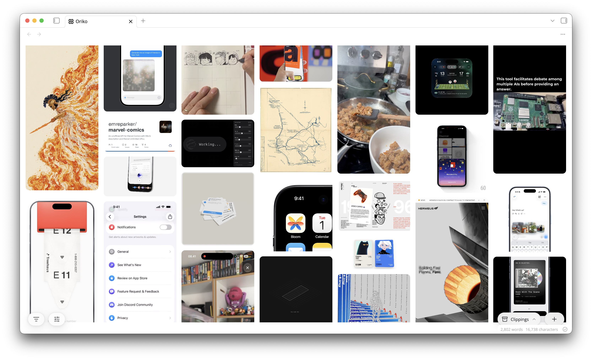

  <picture>
    <source media="(prefers-color-scheme: dark)" srcset="https://raw.githubusercontent.com/trevware/oriko/HEAD/.github/oriko-dark.svg">
    
  </picture>

# Oriko

Turn your web clippings into a wall of pictures. Oriko lays out every clipping in your folder as a pannable, zoomable masonry wall, downloads a local copy of each clipping's media so posts survive their source going dark, and keeps everything in plain markdown notes that read fine without it.

*The name is Japanese: an oriko (織り子) is a weaver, someone who turns loose threads into one cloth. Weaving scattered inspiration into a single wall is the whole idea.*

  <picture>
    
  </picture>

  <b>Oriko is free, and built in my spare time.</b> 
  If it earns a place in your vault, buying me a coffee keeps it going.

  

## Clipping

Paste a link anywhere on the wall, or run **Clip from clipboard** from the command palette. Oriko reads the page, downloads its images and video into your attachment folder, and writes a markdown note into your clippings folder. Pasting or dropping a picture or video saves it as a clipping of its own, and pasting a link you already clipped opens the existing note instead of duplicating it.

| Source | What you get |
| --- | --- |
| An article or product page | The page's own preview image, title, author and date |
| A direct image or video URL | The file itself, saved as its own clipping |
| An X or Instagram post | The post's media, via optional community resolvers |
| A Threads post | The video, found by loading the post itself (desktop) |
| Notes from the [Obsidian Web Clipper](https://obsidian.md/clipper) | They appear on the wall, and their remote media is downloaded in the background |

On iOS you can clip straight from any app's share sheet: make a Shortcut that receives URLs and text, runs **Get URLs from Input**, URL-encodes the result, and opens `obsidian://oriko?url=` followed by the encoded text. Sharing a post to that Shortcut opens the wall and clips it, no copy and paste involved.

## The wall

Every clipping is a tile: pan and pinch on a phone, scroll and zoom on a desktop, and click or tap a tile to open it full screen with its properties and actions. Videos can autoplay muted while they are in view, respecting Reduce Motion. Select many at once with a drag on desktop or a long press on mobile, then move, export or delete them together.

**Search this grid** opens a palette over the wall: every command, every filter value and every clipping in the vault by name, with previews.

## Grids

Grids are boards. A clipping belongs to a grid through a single `grid` property in its frontmatter, home shows everything, and smart grids collect clippings by rule instead of by hand. The set of grids is shared across your devices through one small note in the clippings folder, so a board made on your desktop is on your phone after a sync.

## Filters

Any frontmatter property can become a filter. Enable properties under **Settings → Filter properties**, then slice the wall from the filter button: categories, status, domain, dates, whatever your clippings carry.

## Downloads

Remote media is copied into your attachment folder under a name derived from its URL, so the same asset shared by several clippings is stored once. Posters and thumbnails are generated for videos and GIFs, downloads above a size cap are skipped, and **Remove orphaned media** offers up files no clipping points at any more, always behind a confirmation and always to the trash. If a local [yt-dlp](https://github.com/yt-dlp/yt-dlp) is installed on desktop, the full video of a clipped post is fetched with it.

Notes are never rewritten. Oriko writes a note once when it creates one, and the only property it ever edits afterwards is the `grid` key and the properties you have explicitly enabled, through Obsidian's own frontmatter API.

## What touches the network

Oriko fetches only what you clip: the page you pasted and the media it references. The optional community resolvers send X and Instagram URLs to public mirrors (fxtwitter, kkinstagram) to reach video those sites hide; turn them off in settings to stay first party. There are no analytics and nothing is reported anywhere.

## Installation

Install from **Settings → Community plugins** by searching for Oriko, or grab `main.js`, `manifest.json` and `styles.css` from the [latest release](https://github.com/trevware/oriko/releases) into `.obsidian/plugins/oriko/`.
